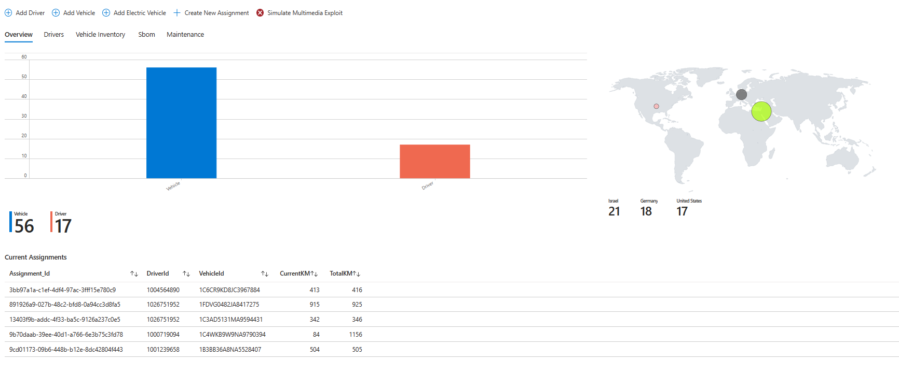
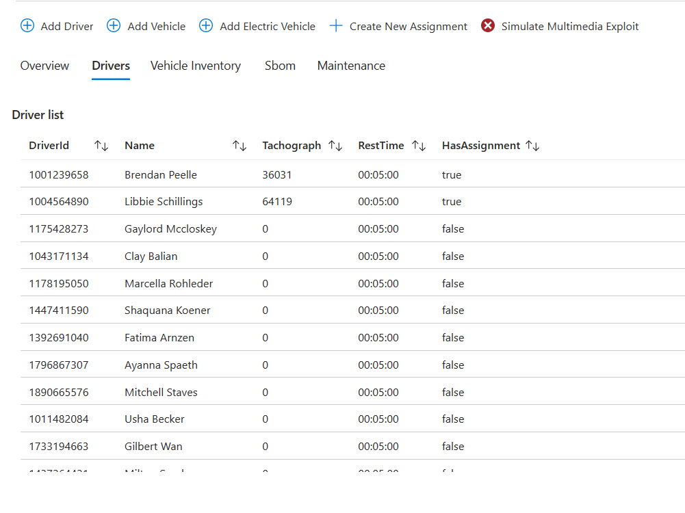
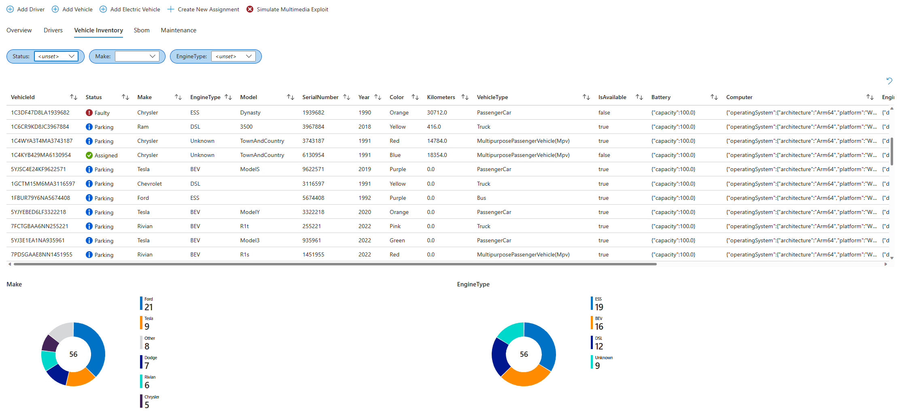
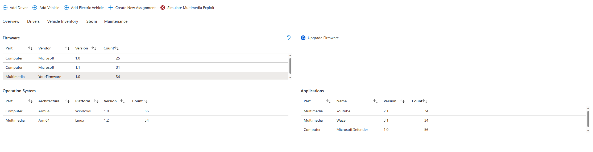
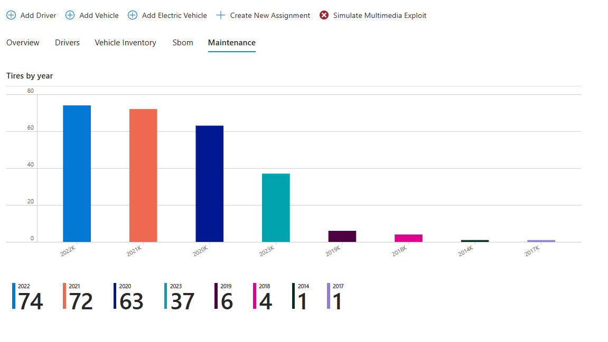
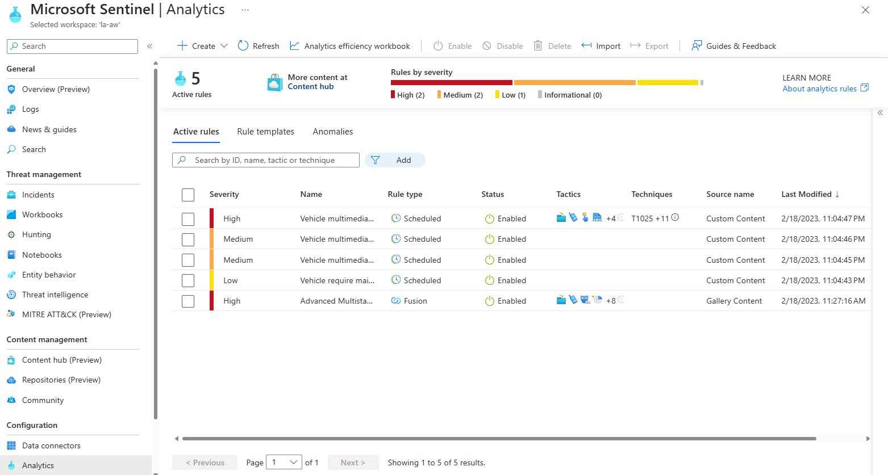
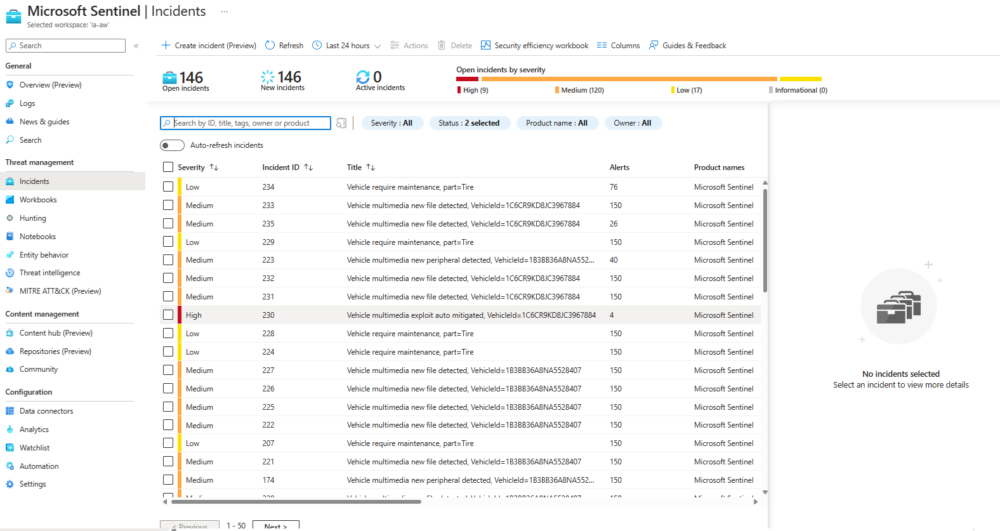
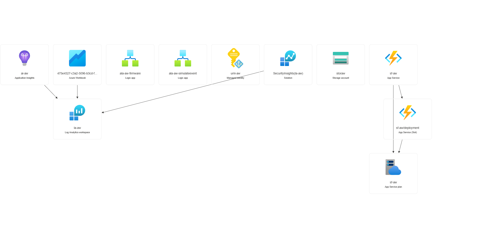

# Automotive World - Simulator

## Demo

### Microsoft Sentinel Workbook

**Overview**


**Drivers**


**Vehicles**


**Sbom**


**Maintenance**



### Microsoft Sentinel
**AlertRules**


**Incidents**



## Architecture



## Development Prerequisites
1. VSCode: https://code.visualstudio.com/download
1. Dotnet 6
1. Update `local.settings.json`
    | # | Environment Variable                |
    |---|-------------------------------------|
    | 1 | LOG_ANALYTICS_WORKSPACE_ID          |
    | 2 | LOG_ANALYTICS_WORKSPACE_PRIMARY_KEY |
    | 3 | LOG_ANALYTICS_WORKSPACE_TABLE_NAME  |
    | 4 | LOG_ANALYTICS_WORKSPACE_RESOURCE_ID |
    | 5 | SimulatorScheduleExpression         |
    | 6 | SimulateEventTriggerScheduleExpression  |


## Microsoft Sentinel

### Alert Rules
Deployed while function startup, and updated via TimerTrigger


### Azure Workbook
See `resources/AutomotiveWorldWorkbook.workbook`

## Deployment
```bash
# Set subcription scope
az account set --subscription <subscription_id>

# Create Resource Group
az group create --location <location> --name <name> --tags owner=<value>

# Deploy ARM Template
az group deployment create --resource-group <name> --template-file .deploy/azuredeploy.json --parameters .deploy/parameters.json
```
